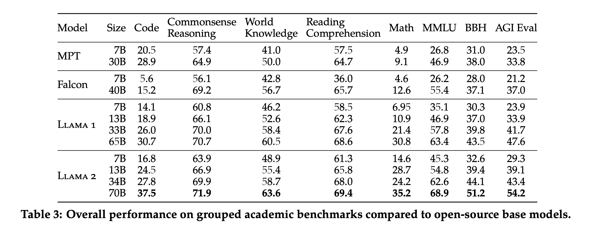

# awesome-llamas

Awesome repositories for using LLaMA1 and LLaMA2 models.

Given LLaMA2 is the first open source language model that is competitive with ChatGPT, thought it made sense to start documenting what is built on top of it. 

## LLaMA2 Models
- Original - Meta released 7B, 13B and 70B pre-trained and chat versions.
    - [Llama-2-70b](https://huggingface.co/meta-llama/Llama-2-70b)
    - [Llama-2-70b-chat](https://huggingface.co/meta-llama/Llama-2-70b-chat) - Other model sizes can be found here: https://huggingface.co/meta-llama.
    - [Demo of 70b-chat](https://huggingface.co/spaces/ysharma/Explore_llamav2_with_TGI) in a HuggingFace Space using TGI
- GGML Format - GGML files are for CPU + GPU inference using `llama.cpp` and libraries and UIs which support this format. Works with Apple M1 or M2 GPUs.
    - [Llama-2-70B-Chat-GGML](https://huggingface.co/TheBloke/Llama-2-70B-Chat-GGML) - Other model sizes can be found here: https://huggingface.co/TheBloke

## Benchmarks
- [Open LLM Leaderboard](https://huggingface.co/spaces/HuggingFaceH4/open_llm_leaderboard) - see models that have llama or llama-2 in the name.
- LLaMA2 is competitive with similarly sized open source models on Academic Benchmarks. The figure below is also from the [LLaMA2 paper](https://arxiv.org/pdf/2307.09288.pdf).
    - 
- LLaMA2 is competitive with GPT3.5 on Human Evaluation. The figure below is also from the [LLaMA2 paper](https://arxiv.org/pdf/2307.09288.pdf).
    - 
- [LLaMA2 is competitive with GPT3.5 in Medical applications](https://twitter.com/katieelink/status/1683479042886860801)

## Derivative Models
- [FreeWilly2](https://huggingface.co/stabilityai/FreeWilly2) - FreeWilly2 is a Llama2 70B model finetuned on an Orca style Dataset, beating Llama-2-70b-chat on the HuggingFace Open LLM Leaderboard
- [FreeWilly1](https://huggingface.co/stabilityai/FreeWilly1-Delta-SafeTensor) - FreeWilly is a Llama65B model fine-tuned on an Orca style Dataset
- [Dolphin LLama](https://huggingface.co/ehartford/dolphin-llama-13b) - open source implementation of Microsoft's Orca model, based on Llama 1, not for commercial use.

## Inference
- [mlc-llm](https://github.com/mlc-ai/mlc-llm) - Running LLaMA2 on iOS devices natively using GPU acceleration, see [example](https://twitter.com/bohanhou1998/status/1681682445937295360)
- [llama2.c](https://github.com/karpathy/llama2.c) - Inference Llama 2 in one file of pure C by Andrej Karpathy
- [Running inference locally on a M1 Mac](https://lawwu.github.io/posts/2023-07-20-llama-2-local/) - Post I wrote for how to run [Llama-2-13B-chat-GGML](https://huggingface.co/TheBloke/Llama-2-13B-chat-GGML) locally on a Mac getting around 15-20 tokens per second.

## Papers
- [LLaMA2 Paper - Llama 2: Open Foundation and Fine-Tuned Chat Model](https://arxiv.org/pdf/2307.09288.pdf) - Released 2023-07-18
- [LLaMA1 Paper - LLaMA: Open and Efficient Foundation Language Models](https://arxiv.org/abs/2302.13971) - Released 2023-02-27

## Tutorials
- [How to deploy LLaMA2 or any open-source LLM using HuggingFace's TGI](https://twitter.com/mervenoyann/status/1683499091223781376)
- [How to Build a LLaMA2 Chatbot in Streamlit](https://blog.streamlit.io/how-to-build-a-llama-2-chatbot/)
- [LLaMa 70B Chatbot in Hugging Face and LangChain](https://github.com/pinecone-io/examples/blob/master/learn/generation/llm-field-guide/llama-2-70b-chat-agent.ipynb)

## News
- 2023-07-18 - [Llama 2: an incredible open LLM](https://www.interconnects.ai/p/llama-2-from-meta)
- 2023-07-18 - [Llama 2 is here - get it on Hugging Face](https://huggingface.co/blog/llama2)
- 2023-07-18 - [Qualcomm Works with Meta to Enable On-device AI Applications Using Llama 2](https://www.qualcomm.com/news/releases/2023/07/qualcomm-works-with-meta-to-enable-on-device-ai-applications-usi)
- 2023-04-30 - [A Brief History of LLaMA Models](https://agi-sphere.com/llama-models/)