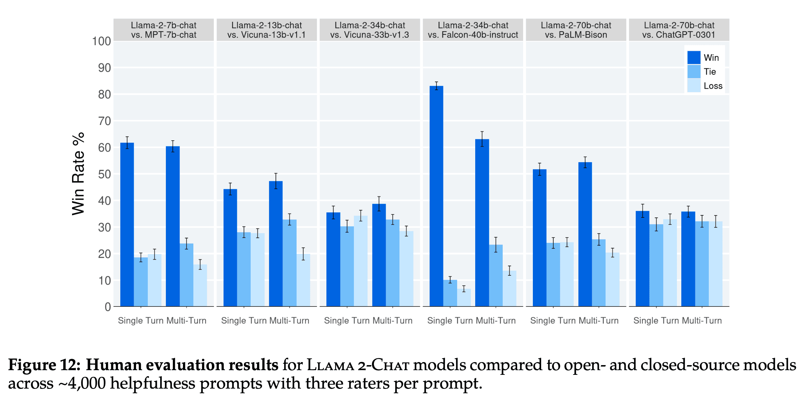

# awesome-llamas

Awesome repositories for using LLaMA1 and LLaMA2 models from Meta.

Given LLaMA2 is the first open source language model that is competitive with ChatGPT, thought it made sense to start documenting what is built on top of it. The main difference between LLaMA2 and LLaMA 1 is: LLaMA 2 available for free for research and commercial-use and it supports twice the context length of LLaMA 1.

## LLaMA2 Models
- Original - Meta released 7B, 13B and 70B pre-trained and chat versions.
    - [Llama-2-70b](https://huggingface.co/meta-llama/Llama-2-70b)
    - [Llama-2-70b-chat](https://huggingface.co/meta-llama/Llama-2-70b-chat) - Other model sizes can be found here: https://huggingface.co/meta-llama.
    - [Demo of 70b-chat](https://huggingface.co/spaces/ysharma/Explore_llamav2_with_TGI) in a HuggingFace Space using TGI
    - [Demo of 13b-chat](https://huggingface.co/spaces/huggingface-projects/llama-2-13b-chat)
- GGML Format - GGML files are for CPU + GPU inference using `llama.cpp` and libraries and UIs which support this format. Works with Apple M1 or M2 GPUs.
    - [Llama-2-70B-Chat-GGML](https://huggingface.co/TheBloke/Llama-2-70B-Chat-GGML) - Other model sizes can be found here: https://huggingface.co/TheBloke

## Benchmarks
- [AlpacaEval](https://twitter.com/yanndubs/status/1684567600934817792) - LLaMA2-70B-chat is better than ChatGPT and Claude2, trailing only GPT-4 as of 2023-07-27.
- [Open LLM Leaderboard](https://huggingface.co/spaces/HuggingFaceH4/open_llm_leaderboard) - see models that have llama or llama-2 in the name.
- LLaMA2 is competitive with similarly sized open source models on Academic Benchmarks. The figure below is also from the [LLaMA2 paper](https://arxiv.org/pdf/2307.09288.pdf).
    - 
- LLaMA2 is competitive with GPT3.5 on Human Evaluation. The figure below is also from the [LLaMA2 paper](https://arxiv.org/pdf/2307.09288.pdf).
    - 
- [LLaMA2 is competitive with GPT3.5 in Medical applications](https://twitter.com/katieelink/status/1683479042886860801)

## Derivative Models
- [StableBeluga2](https://huggingface.co/stabilityai/StableBeluga2) - Stable Beluga 2 is a Llama2 70B model finetuned on an Orca style Dataset
- [Mikael110/llama-2-70b-guanaco-qlora](https://huggingface.co/Mikael110/llama-2-70b-guanaco-qlora) - first time we got a model that defeats ChatGPT at MMLU
- [airoboros-12-70b-gpt4-1.4.1](https://huggingface.co/jondurbin/airoboros-l2-70b-gpt4-1.4.1)
- [Nous-Hermes-Llama2-13b](https://huggingface.co/NousResearch/Nous-Hermes-Llama2-13b)
- [LLongMA-2-13b-16k](https://huggingface.co/conceptofmind/LLongMA-2-13b-16k) - Releasing LLongMA-2-13b-16k, a Llama-2 model, trained at 16k context length using linear positional interpolation scaling. 8k context length is also available. ([post](https://www.linkedin.com/posts/enrico-shippole-495521b8_conceptofmindllongma-2-13b-hugging-face-activity-7089288709220524032-75yV/?trk=public_profile_like_view)). Also [LLaMA-2-7B-32k](https://huggingface.co/togethercomputer/LLaMA-2-7B-32K)
- [WizardLM-13B-V1.2](https://huggingface.co/WizardLM/WizardLM-13B-V1.2) - The WizardLM-13B-V1.2 achieves 7.06 on [MT-Bench Leaderboard](https://chat.lmsys.org/?leaderboard), [89.17% on AlpacaEval Leaderboard](https://tatsu-lab.github.io/alpaca_eval/), which is better than Claude and ChatGPT, and 101.4% on WizardLM Eval. [WizardLM repo](https://github.com/nlpxucan/WizardLM)
- [FreeWilly2](https://huggingface.co/stabilityai/FreeWilly2) - FreeWilly2 is a Llama2 70B model finetuned on an Orca style Dataset, beating Llama-2-70b-chat on the HuggingFace Open LLM Leaderboard
- [FreeWilly1](https://huggingface.co/stabilityai/FreeWilly1-Delta-SafeTensor) - FreeWilly is a Llama65B model fine-tuned on an Orca style Dataset
- [LongLLaMA: Focused Transformer Training for Context Scaling](https://huggingface.co/syzymon/long_llama_3b)
- [Dolphin LLama](https://huggingface.co/ehartford/dolphin-llama-13b) - open source implementation of Microsoft's Orca model, based on Llama 1, not for commercial use.

## Libraries
- [TinyLlama](https://github.com/jzhang38/TinyLlama) - pretrain a 1.1B Llama model on 3 trillion tokens. With some proper optimization, we can achieve this within a span of "just" 90 days using 16 A100-40G GPUs
- [open-interpreter](https://github.com/shroominic/codeinterpreter-api) - Open source version of OpenAI's Code Interpreter. Works with GPT-4 and llama2.
- [Code Llama](https://about.fb.com/news/2023/08/code-llama-ai-for-coding/) - Code Llama is an AI model built on top of Llama 2, fine-tuned for generating and discussing code. Also this [Huggingface blog post on Code Llama](https://huggingface.co/blog/codellama).
- [llama-gpt](https://github.com/getumbrel/llama-gpt) - A self-hosted, offline, ChatGPT-like chatbot. Powered by Llama 2. 100% private, with no data leaving your device
- [LLaMA-Efficient-Tuning](https://github.com/hiyouga/LLaMA-Efficient-Tuning) - Easy-to-use LLM fine-tuning framework (LLaMA-2, BLOOM, Falcon, Baichuan, Qwen, ChatGLM2)
- [ollama](https://github.com/jmorganca/ollama) - Get up and running with Llama 2 and other large language models locally
- [mlc-llm](https://github.com/mlc-ai/mlc-llm) - Running LLaMA2 on iOS devices natively using GPU acceleration, see [example](https://twitter.com/bohanhou1998/status/1681682445937295360)
- [llama2.c](https://github.com/karpathy/llama2.c) - Inference Llama 2 in one file of pure C by Andrej Karpathy
- [LLaMA-Efficient-Tuning](https://github.com/hiyouga/LLaMA-Efficient-Tuning) - Easy-to-use fine-tuning framework using PEFT (PT+SFT+RLHF with QLoRA) (LLaMA-2, BLOOM, Falcon, Baichuan, Qwen)
- [h2o-llmstudio](https://github.com/h2oai/h2o-llmstudio) - H2O LLM Studio - a framework and no-code GUI for fine-tuning LLMs. Documentation: https://h2oai.github.io/h2o-llmstudio/
- [Llama2-Chinese](https://github.com/FlagAlpha/Llama2-Chinese) - Llama中文社区，最好的中文Llama大模型，完全开源可商用

## Papers
- [LLaMA2 Paper - Llama 2: Open Foundation and Fine-Tuned Chat Model](https://arxiv.org/pdf/2307.09288.pdf) - Released 2023-07-18
- [LLaMA1 Paper - LLaMA: Open and Efficient Foundation Language Models](https://arxiv.org/abs/2302.13971) - Released 2023-02-27

## Tutorials
- [Running 13b-chat inference locally on Apple Silicon](https://lawwu.github.io/posts/2023-07-20-llama-2-local/) - Post I wrote for how to run [Llama-2-13B-chat-GGML](https://huggingface.co/TheBloke/Llama-2-13B-chat-GGML) locally on a Mac getting around 15-20 tokens per second.
- [How to fine-tune LLaMA2](https://scale.com/blog/fine-tune-llama-2)
- [Running Llama 2 on CPU Inference Locally for Document Q&A](https://towardsdatascience.com/running-llama-2-on-cpu-inference-for-document-q-a-3d636037a3d8)
- [How to deploy LLaMA2 or any open-source LLM using HuggingFace's TGI](https://twitter.com/mervenoyann/status/1683499091223781376)
- [How to Build a LLaMA2 Chatbot in Streamlit](https://blog.streamlit.io/how-to-build-a-llama-2-chatbot/)
- [LLaMa 70B Chatbot in Hugging Face and LangChain](https://github.com/pinecone-io/examples/blob/master/learn/generation/llm-field-guide/llama-2-70b-chat-agent.ipynb)

## News
- 2023-08-30 - [AI Silicon Valley = RealChar + AI town + Llama2](https://twitter.com/agishaun/status/1696915991739920791)
- 2023-07-28 - [Meta’s Open Source Llama Upsets the AI Horse Race](https://www.wired.com/story/metas-open-source-llama-upsets-the-ai-horse-race/) - Meta is giving its answer to OpenAI’s GPT-4 away for free. The move could intensify the generative AI boom by making it easier for entrepreneurs to build powerful new AI systems.
- 2023-07-23 - [OpenAI Function calling with llama2](https://twitter.com/hwchase17/status/1683153581200019456)
- 2023-07-20 - [LLaMA 2: Every Resource You Need](https://www.philschmid.de/llama-2)
- 2023-07-18 - [Llama 2: an incredible open LLM](https://www.interconnects.ai/p/llama-2-from-meta)
- 2023-07-18 - [Llama 2 is here - get it on Hugging Face](https://huggingface.co/blog/llama2)
- 2023-07-18 - [Qualcomm Works with Meta to Enable On-device AI Applications Using Llama 2](https://www.qualcomm.com/news/releases/2023/07/qualcomm-works-with-meta-to-enable-on-device-ai-applications-usi)
- 2023-04-30 - [A Brief History of LLaMA Models](https://agi-sphere.com/llama-models/)